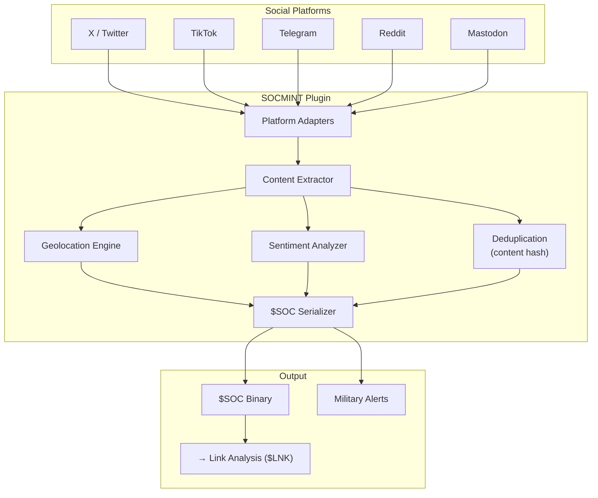

# 📱 Social Media Intelligence (SOCMINT) Plugin

[](https://github.com/the-lobsternaut/socmint-sdn-plugin/actions)
[](LICENSE)
[](https://en.cppreference.com/w/cpp/17)
[](https://github.com/the-lobsternaut)

**Structured intelligence extraction from social media — geolocated posts, military movement indicators, disinformation detection, sentiment analysis, and cross-platform deduplication.**

---

## Overview

The SOCMINT plugin extracts structured intelligence from social media platforms and feeds it into the Space Data Network's link analysis and alert pipelines.

### Supported Platforms

| Platform | Capabilities |
|----------|-------------|
| **X / Twitter** | Geotagged posts, trending topics, bot detection |
| **TikTok** | Geolocated videos, viral content tracking |
| **Telegram** | Channel monitoring, message forwarding, group intel |
| **Reddit** | Subreddit monitoring, sentiment analysis |
| **Mastodon** | Federated social monitoring |

### Intelligence Extraction

- **Geolocation** — extract coordinates from tagged posts, mentioned locations, image EXIF
- **Military movement indicators** — keywords, unit mentions, equipment sightings
- **Disinformation patterns** — coordinated inauthentic behavior, amplification networks
- **Sentiment analysis** — per-topic sentiment scoring and trend detection
- **Cross-platform deduplication** — content hash matching across platforms

---

## Architecture



---

## Data Sources & APIs

| Source | URL | Type | Auth |
|--------|-----|------|------|
| **X API v2** | [api.twitter.com/2](https://api.twitter.com/2) | REST/Streaming | OAuth 2.0 |
| **Telegram Bot API** | [api.telegram.org](https://api.telegram.org/) | REST | Bot token |
| **Reddit API** | [oauth.reddit.com](https://oauth.reddit.com/) | REST | OAuth 2.0 |
| **Mastodon API** | Instance-specific | REST | OAuth 2.0 |

---

## Research & References

- **Bellingcat Investigation Toolkit** — [bellingcat.com](https://www.bellingcat.com/). OSINT investigation methodology.
- Ferrara, E. et al. (2016). ["The Rise of Social Bots"](https://doi.org/10.1145/2818717). *Communications of the ACM*. Bot detection methods.
- Chen, E. et al. (2021). ["COVID-19 misinformation and the 2020 U.S. presidential election"](https://doi.org/10.1177/1558689821103469). Disinformation pattern analysis.
- **NATO StratCom COE** — [stratcomcoe.org](https://stratcomcoe.org/). Information environment analysis frameworks.

---

## Technical Details

### Military Movement Indicators

| Indicator | Detection Method |
|-----------|-----------------|
| Equipment sightings | Image classification + keyword matching |
| Unit mentions | Named entity recognition |
| Movement patterns | Geolocated post clustering over time |
| Supply chain activity | Logistics keyword detection |

### Sentiment Analysis

| Score Range | Label | Description |
|------------|-------|-------------|
| [-1.0, -0.5] | Very Negative | Strong negative sentiment |
| (-0.5, -0.1] | Negative | Mild negative |
| (-0.1, 0.1) | Neutral | No strong sentiment |
| [0.1, 0.5) | Positive | Mild positive |
| [0.5, 1.0] | Very Positive | Strong positive |

---

## Build Instructions

```bash
git clone --recursive https://github.com/the-lobsternaut/socmint-sdn-plugin.git
cd socmint-sdn-plugin
mkdir -p build && cd build
cmake ../src/cpp -DCMAKE_CXX_STANDARD=17
make -j$(nproc) && ctest --output-on-failure
```

---

## Plugin Manifest

```json
{
  "schemaVersion": 1,
  "name": "socmint",
  "version": "0.1.0",
  "description": "Social Media Intelligence — structured intel from X, TikTok, Telegram, Reddit, Mastodon.",
  "author": "DigitalArsenal",
  "license": "Apache-2.0",
  "inputFormats": ["application/json"],
  "outputFormats": ["$SOC"]
}
```

---

## License

Apache-2.0 — see [LICENSE](LICENSE) for details.

*Part of the [Space Data Network](https://github.com/the-lobsternaut) plugin ecosystem.*
